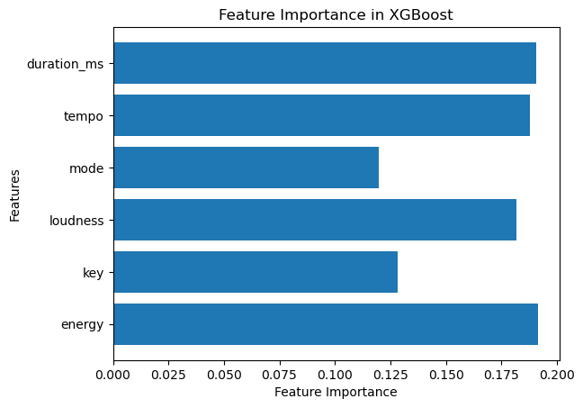
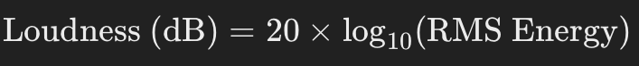
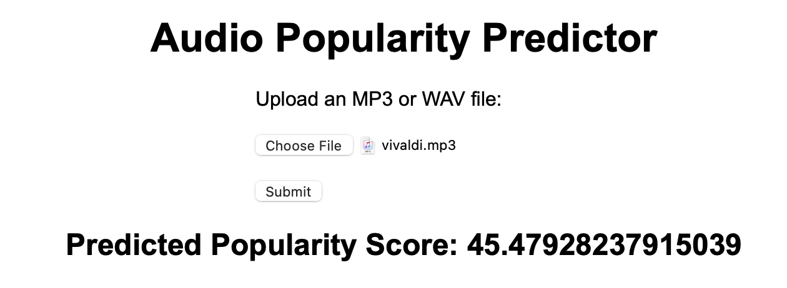

# Song Popularity Prediction

This project harnesses the power of machine learning combined with historical Spotify data to develop a robust system for predicting any audio/song popularity. By analyzing various factors such as song tempo, energy, key, loudness, mode and duration in miliseconds [ms], the model aims to provide accurate song popularity prediction. This could help independent artist to estimate how likely is there song to become popular based on the Spotify algorithm and metrics. Spotify API for obtaining song features is depricated as of late 2023. Additionally, Spotify documentation doesn't provide any method that explains how they calculate such features. Consequently, some features were excluded from the analysis, as they could not be calculated for the query audios. The model's accuracy and effectiveness could have been further improved by including features like danceability, acousticness, and instrumentalness, which were unfortunately unavailable.

# Dataset

This dataset contains detailed information about nearly 30,000 songs sourced from the Spotify API, designed to assist in music analysis and machine learning tasks related to song characteristics, popularity, and playlist categorization. The dataset includes various song-level, album-level, and playlist-level features, along with musical attributes derived from Spotify's audio analysis.

The dataset is crucial for training the models, allowing them to learn patterns and relationships between features such as song tempo, energy, key, loudness, mode and duration to estimate song popularity efficiently.

# Models Used

**XGBoost**: A powerful, efficient, and scalable implementation of gradient-boosted decision trees (GBDT), an ensemble learning technique. It is widely used in machine learning tasks, particularly for structured or tabular data. XGBoost builds a series of decision trees sequentially, where each tree tries to correct the errors made by the previous ones. The results of all trees are combined to make the final prediction.

Random Forest, optimized with oneAPI, emerged as the most efficient and accurate model. The combination of hardware acceleration and hyperparameter tuning ensured the model performed well under various conditions.
​
### ✅Data Preparation:

Gather historical Spotify song data, including features such as song tempo, energy, key, loudness, mode and duration. We have performed an EDA (Exploratory Data Analysis) and found that there was no missing values and other data discrepancies. Data was split in 80/20 ratio for model training and testing.

🎶 Energy: A measure of intensity and activity in a song.
🎶 Key: The musical key of the song.
🎶 Loudness: The overall loudness level of the song, in decibels.
🎶 Mode: Indicates whether the song is in a major or minor mode.
🎶 Tempo: The speed or pace of the song, measured in beats per minute (BPM).
🎶 Duration_ms: The duration of the song, in milliseconds.

​

### ✅Model Evaluation:

To extract features from the query audio file, we utilized the Python library Librosa. Using Librosa, we successfully extracted various audio characteristics, including tempo, duration, key, and mode. Additionally, we computed energy and loudness based on the audio signal.

Energy Calculation

Energy was calculated using the Root Mean Square (RMS) value of the audio signal over time. The RMS measures the average power of the signal, which provides an indicator of its intensity. It is computed as:

​

where x[i] represents the amplitude of the audio signal.

Loudness Calculation

Loudness was derived from the RMS energy, expressed in decibels (dB). The formula to convert RMS energy to loudness is:

​

This provides a perceptual measure of loudness as it is heard by human listeners, correlating with the intensity of the audio signal.

By combining these features with others such as tempo and key, we ensured a comprehensive analysis of the audio's characteristics, which was critical for evaluating and predicting the desired outcomes.
​

### ✅How to run:

Follow the steps below to install, configure, and run the Flask application on your local machine:

1. Clone the Repository
Download the project code:

git clone https://github.com/iammarcol/song_popularity.git
cd song_popularity

2. Set Up a Virtual Environment

conda create --name song_popularity_env python=3.10 -y
conda activate song_popularity_env

3. Install Dependencies

Install the required Python libraries using the following command:
pip install -r requirements.txt

4. Ensure Required Files Are Present

Ensure the following files are present in the model/ directory:

xgb_popularity_model.json: The pretrained model file.
scaler.joblib: The scaler file for feature preprocessing.

5. Run the Application

Start the Flask application by running:
python app.py

6. Open the Web Application

Open a web browser and navigate to the following URL:

http://127.0.0.1:5000

7. Upload an Audio File

Use the upload form to submit an MP3 or WAV file for prediction.
The application will process the file and display the predicted popularity score.

An example output is given here:

​

To stop the Flask server, press CTRL+C in the terminal.
